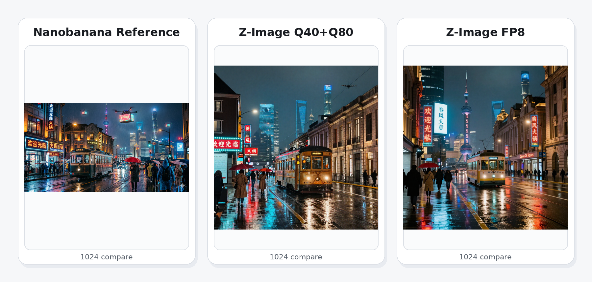

<p align="center">
  
</p>

# stable-diffusion.cpp

<div align="center">
  <a href="https://trendshift.io/repositories/9714" target="_blank">
    
  </a>
</div>

Diffusion model(SD,Flux,Wan,...) inference in pure C/C++

***Note that this project is under active development. \
API and command-line option may change frequently.***

## Adreno Optimization Fork

This fork is purpose-built for **Adreno 830 + Q4_0** deployment (FLUX.2-klein / Z-Image / Qwen3-4B), with strict step-by-step numeric validation and reproducible logs/images.

**Tracking**

- Full optimization logbook (GOAL-aligned): [`docs/adreno/README.md`](./docs/adreno/README.md)
- Per-step reports and assets: [`docs/adreno/steps/`](./docs/adreno/steps/) + [`docs/adreno/assets/`](./docs/adreno/assets/)
- Runtime/build switch catalog (with accepted presets): [`docs/adreno/flags.md`](./docs/adreno/flags.md)
- Step-tag map: [`docs/adreno/TAGS.md`](./docs/adreno/TAGS.md)

**Fork Branch Model**

- `work/main`: full Adreno optimization + debugging history (performance-first engineering branch)
- `pr/main`: upstream-oriented clean branch (minimal patch surface, neutral naming, merge-friendly docs)

### Performance Snapshot

| Case | Baseline | Optimized | Gain |
|---|---:|---:|---:|
| FLUX.2-klein 1024 flash-on (step forward) | 209.81 s/step | 31.256 s/step | 6.71x |
| Z-Image 1024 step1 flash-on | 341.70 s | 50.90 s | 6.71x |
| FLUX.2-klein 512 full 4-step final gate | 47.81 s total | 38.06 s total | 1.26x |
| FLUX.2-klein 512 edit final gate | 74.96 s total | 67.36 s total | 1.11x |
| FLUX.2-klein 512 edit (2 refs) gate | 100.21 s total | 98.93 s total | pass |

### Before / After (Real Step Artifacts)

| Scenario | Before | After |
|---|---|---|
| FLUX.2-klein 512 final gate |  |  |
| FLUX.2-klein 512 edit (2 refs) |  |  |
| Z-Image 512 8-step |  |  |

### Quick Entry (Adreno)

1. Read the frozen presets in [`docs/adreno/flags.md`](./docs/adreno/flags.md).
2. Replay accepted steps from [`docs/adreno/steps/`](./docs/adreno/steps/).
3. Use `work/main` for performance experiments, and `pr/main` for upstream-ready patch preparation.

## Hexagon NPU Support

- Current HTP path targets Snapdragon `8 Gen1 / 8 Gen2 / 8 Gen3 / 8e / 8e5` class NPUs.
- `FP8/WF8` models require `v79+` NPU. In practice this means the faster FP8 route is for `8e`-class `v79` and later only.
- `FP8/WF8` gives both better throughput and better image quality than the old low-bit fallback route.
- Current validation has already passed on `8e` and `8e5`.

### Z-Image Example

**Current Z-Image 1024 Snapshot**

| Route | Single-step sampling |
|---|---:|
| `v79` Z-Image `q40+q80` | `16.27 s` |
| `v79` Z-Image `FP8/WF8` | `15.29 s` |

Prompt used in the local Z-Image compare:

```text
雨夜的未来上海外滩，镜头前是一辆旧式有轨电车穿过积水街道，街边霓虹牌同时写着“欢迎光临”“火锅”“Open 24 Hours”，远处玻璃摩天楼与石库门老建筑并列，空中漂浮无人机广告屏，屏幕上有清晰汉字“春风得意”，画面里有穿风衣的人群、红色雨伞、湿漉漉的柏油路反射青蓝与橙红灯光，构图复杂、层次深、电影感、超细节
```

<p align="center">
  
</p>

<p align="center">
  <sub>Nanobanana reference • Z-Image Q40+Q80 • Z-Image FP8</sub>
</p>

- The current local `Z-Image FP8` single-step time is about `15s` on-device.
- Full local generation is about `2 min`, and the image quality is already close to the Nanobanana reference above.

## Quick Start (HTP v75/v79)

Use placeholder paths below and replace them with your local checkout / SDK / NDK locations.

Worktree root:

- `$WORKTREE_ROOT`

Build rule:

- `htp_ops` must be built three times:
  - Android host-side `libhtp_ops.so`
  - Hexagon `v75` `libhtp_ops_skel.so`
  - Hexagon `v79` `libhtp_ops_skel.so`
- `sdcpp` Android side is built once:
  - `sd-cli`
  - `libggml-htp-v79.so`
- runtime arch switch is done by choosing which `libhtp_ops_skel.so` to push to phone

Requirements:

- `HEXAGON_SDK_ROOT`
- `HEXAGON_TOOLS_ROOT`
- `ANDROID_NDK`

Example build commands:

```sh
set -euo pipefail

ROOT=/path/to/reqfix1_hvx_rope_main
OUT=$ROOT/scratch/quickstart_htp_build
SDK=/path/to/Hexagon_SDK/6.5.0.0
TOOLS=$SDK/tools/HEXAGON_Tools/19.0.07
NDK=/path/to/android-ndk

mkdir -p "$OUT"

cmake -S $ROOT/htp_ops -B "$OUT/htp_android_rel" \
  -DCMAKE_TOOLCHAIN_FILE=$SDK/build/cmake/android_toolchain.cmake \
  -DCMAKE_BUILD_TYPE=Release \
  -DANDROID_ABI=arm64-v8a \
  -DANDROID_NDK=$NDK \
  -DANDROID_NATIVE_API_LEVEL=26 \
  -DANDROID_STL=none \
  -DHEXAGON_SDK_ROOT=$SDK \
  -DOS_TYPE=HLOS \
  -DDSP_TYPE=3 \
  -DPREBUILT_LIB_DIR=android_aarch64 \
  -DV=android_ReleaseG_aarch64

cmake -S $ROOT/htp_ops -B "$OUT/htp_hex_v75_rel" \
  -DCMAKE_TOOLCHAIN_FILE=$SDK/build/cmake/hexagon_toolchain.cmake \
  -DCMAKE_BUILD_TYPE=Release \
  -DHEXAGON_SDK_ROOT=$SDK \
  -DHEXAGON_TOOLS_ROOT=$TOOLS \
  -DDSP_VERSION=v75 \
  -DPREBUILT_LIB_DIR=hexagon_toolv19_v75 \
  -DV=hexagon_ReleaseG_toolv19_v75

cmake -S $ROOT/htp_ops -B "$OUT/htp_hex_v79_rel" \
  -DCMAKE_TOOLCHAIN_FILE=$SDK/build/cmake/hexagon_toolchain.cmake \
  -DCMAKE_BUILD_TYPE=Release \
  -DHEXAGON_SDK_ROOT=$SDK \
  -DHEXAGON_TOOLS_ROOT=$TOOLS \
  -DDSP_VERSION=v79 \
  -DPREBUILT_LIB_DIR=hexagon_toolv19_v79 \
  -DV=hexagon_ReleaseG_toolv19_v79

cmake -S $ROOT/sdcpp -B "$OUT/sdcpp_android_rel" \
  -DCMAKE_TOOLCHAIN_FILE=$NDK/build/cmake/android.toolchain.cmake \
  -DCMAKE_BUILD_TYPE=Release \
  -DANDROID_ABI=arm64-v8a \
  -DANDROID_PLATFORM=android-28 \
  -DSD_HEXAGON=ON \
  -DSD_BUILD_EXAMPLES=ON \
  -DSD_BUILD_SHARED_LIBS=OFF \
  -DGGML_OPENMP=ON \
  -DGGML_HTP=ON \
  -DHEXAGON_SDK_ROOT=$SDK \
  -DHEXAGON_TOOLS_ROOT=$TOOLS \
  -DPREBUILT_LIB_DIR=android_aarch64 \
  -DV=android_ReleaseG_aarch64

cmake --build "$OUT/htp_android_rel" -j$(nproc)
cmake --build "$OUT/htp_hex_v75_rel" -j$(nproc)
cmake --build "$OUT/htp_hex_v79_rel" -j$(nproc)
cmake --build "$OUT/sdcpp_android_rel" -j$(nproc)
```

Runtime choice:

- use `htp_hex_v75_rel/libhtp_ops_skel.so` for `v75`
- use `htp_hex_v79_rel/libhtp_ops_skel.so` for `v79`
- `sd-cli`, `libhtp_ops.so`, and `libggml-htp-v79.so` are shared by both

Release layout:

- ship two Android HTP bundles:
  - `stable-diffusion.cpp-android-htp-v75-<date>.tar.gz`
  - `stable-diffusion.cpp-android-htp-v79-<date>.tar.gz`
- both bundles contain:
  - `sd-cli`
  - `libhtp_ops.so`
  - `libggml-htp-v79.so`
  - `libomp.so`
  - arch-matched `libhtp_ops_skel.so`
- use the `v75` bundle for `q40/q80/f16` routes
- use the `v79` bundle for `q40/q80/f16` and `FP8/WF8` routes

FP8 / WF8 note:

- `FP8/WF8 HMX` models require `v79+`
- do not use `wf8/fp8` GGUF models with `v75`
- `v75` should be used for `q40/q80/f16` style routes only

Example `v79` FP8 Z-Image inference command:

```sh
set -euo pipefail

RUNTIME_V79_DIR=/path/to/runtime-v79
PHONE_MODEL_PACK=/path/to/model_pack
PHONE_AUX=/path/to/model_pack_aux
PHONE_ZIMG_COND=/path/to/zimg_cond.tensor

cd "$RUNTIME_V79_DIR"

env \
  LD_LIBRARY_PATH="$RUNTIME_V79_DIR:/vendor/lib64:/system/lib64" \
  ADSP_LIBRARY_PATH="$RUNTIME_V79_DIR;/vendor/lib/rfsa/adsp;/vendor/dsp" \
  SD_ACCEL_BACKEND=HTP \
  SD_NPU_BACKEND=HTP \
  SD_SKIP_DECODE=1 \
  SD_NPU_OP_PROFILE=1 \
  SD_NPU_HTP_STATS=1 \
  SD_NPU_HTP_FALLBACK=1 \
  GGML_HTP_ENABLE_F16_MATMUL=0 \
  GGML_HTP_ENABLE_QUANT_MATMUL=1 \
  GGML_HTP_ENABLE_FLASH_ATTN=1 \
  GGML_HTP_FLASH_PREP_IN_KERNEL=1 \
  GGML_HTP_ENABLE_ADALN_MATMUL=1 \
  GGML_HTP_ENABLE_CAP_EMBED_MATMUL=1 \
  GGML_HTP_ENABLE_NOISE_REFINER_W2_MATMUL=1 \
  GGML_HTP_ZIMG_ROPE=1 \
  GGML_HTP_DIT_QKNORM_ROPE=1 \
  GGML_HTP_Q8_OUTSTATIONARY=1 \
  GGML_HTP_MAX_MAP_MIB=3072 \
  GGML_HTP_DEFER_UNMAP=1 \
  GGML_HTP_MAX_ACTIVE_MAPS=16 \
  GGML_HTP_SKIP_CORE_PERMUTE_REPACK=0 \
  GGML_HTP_RUNTIME_PERMUTE_QWEIGHTS=0 \
  GGML_HTP_RUNTIME_REPACK_QWEIGHTS=0 \
  ./sd-cli -v \
    --diffusion-model "$PHONE_MODEL_PACK/z_image_turbo_f16base3_wf8hmx_20260409.gguf" \
    --vae "$PHONE_AUX/ae.safetensors" \
    --cond-crossattn "$PHONE_ZIMG_COND" \
    --cfg-scale 1.0 --steps 1 --seed 42 \
    -W 1024 -H 1024 -t 4 --diffusion-fa \
    --output out.png
```
